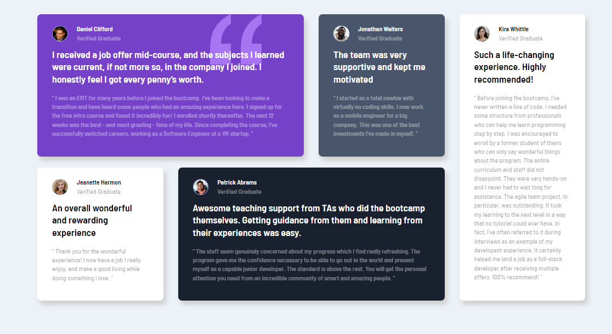

# Frontend Mentor - Testimonials grid section solution

This is a solution to the [Testimonials grid section challenge on Frontend Mentor](https://www.frontendmentor.io/challenges/testimonials-grid-section-Nnw6J7Un7).

## Table of contents

- [Overview](#overview)
  - [The challenge](#the-challenge)
  - [Screenshot](#screenshot)
  - [Links](#links)
- [My process](#my-process)
  - [Built with](#built-with)
  - [What I learned](#what-i-learned)
  - [Useful resources](#useful-resources)
- [Author](#author)
- [Acknowledgments](#acknowledgments)

## Overview

### The challenge

Users should be able to:

- View the optimal layout depending on their device's screen size
- See hover states for interactive elements

### Screenshot



- Mobile


### Links

- Solution: [Frontend Mentor solution by Michel Moreira](https://www.frontendmentor.io/solutions/responsive-section-testemonials-grid-semantic-html5-grid-flexbox-t51__rpk1X)
- Live Site: [Github pages](https://michel-moreira.github.io/testimonials-grid-section/)

## My process

### Built with

- Semantic HTML5 markup
- CSS custom properties
- Flexbox
- CSS Grid
- Mobile-first workflow
- CSS variables

### What I learned

- That project made me learn about semantic HTML5

- Working with flexible display using the flexbox properties, positioning elements on the screen.

- Working with two-dimensional grid system display using the Grid properties, positioning elements on the screen.

- Working with external fonts (Google fonts) to improve a better custom apparence.

- Adapt interactive elements on device mobile with pseudo class ```:hover``` and media queries

```CSS
@media (hover: hover) {
  .container .section {
    display: flex;
    flex-direction: column-reverse;
    border-radius: 0.8rem;
    box-shadow: 2px 4px 4px var(--light-gray);
    padding: 2rem 3rem 1.2rem;
    transition: 0.3s ease-in-out;
  }
  .container .section:hover {
    box-shadow: 5px 8px 10px var(--very-dark-grayish-blue);
  }
}
@media (hover: none) {
  .container .section {
    display: flex;
    flex-direction: column-reverse;
    border-radius: 0.8rem;
    box-shadow: 2px 4px 4px var(--light-gray);
    padding: 2rem 3rem 1.2rem;
    transition: 0.3s ease-in-out;
  }
  .container .section:hover {
    box-shadow: 2px 4px 4px var(--light-gray);
  }
}
```

- Working with separated documents, improving organization and responsability to every document with its function in the whole project.

```html
<link rel="stylesheet" href="src/styles/reset.css" />
<link rel="stylesheet" href="src/styles/variables.css" />
<link rel="stylesheet" href="src/styles/style.css" />
<link rel="stylesheet" href="src/styles/responsive.css" />
```

- Working with variables reducing the code and establishing a pattern easiest to manage.

```CSS
:root {
  --moderate-violet: hsl(263, 55%, 52%);
  --very-dark-grayish-blue: hsl(217, 19%, 35%);
  --very-dark-blackish-blue: hsl(219, 29%, 14%);
  --white: hsl(0, 0%, 100%);

  --light-gray: hsl(0, 0%, 81%);
  --light-grayish-blue: hsl(210, 46%, 95%);
}
```

### Useful resources

- [Figure tag](https://css-tricks.com/quoting-in-html-quotations-citations-and-blockquotes/#aa-hey-what-about-the-figure-element) - This helped me for understand how quotation works and its importance to accessibility. I really liked this knowledge and will use it going forward.
- [Some interactive effects](https://css-tricks.com/css-link-hover-effects/) - This is an amazing article which helped me to expand pseudo class compreension. I'd recommend it to anyone still learning this concept.

## Author

- Github - [Michel Moreira](https://github.com/michel-moreira)
- Frontend Mentor - [@michel-moreira](https://www.frontendmentor.io/profile/michel-moreira)
- LinkdIn - [Michel Moreira](https://www.linkedin.com/in/michel-moreira-760142254/)

## Acknowledgments

To the team of users from the Frontend Mentor that helped me with useful suggestions and feedbacks, promoting an excitement and happiness in the matter of coding. To my personal sponsors (family and friends). To everybody that love coding my whole gratitude.
